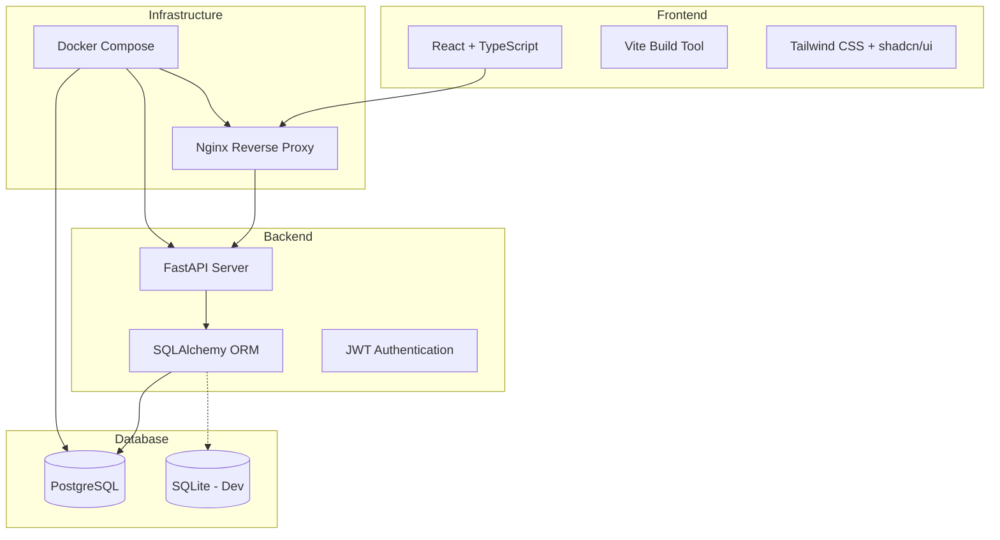

# 🐍 Snake Arena Live

A modern, multiplayer Snake game with real-time leaderboards and live player tracking. Built with FastAPI backend, React frontend, and PostgreSQL database.


## ✨ Features

- 🎮 **Multiple Game Modes**
  - **Walls Mode**: Classic snake with collision detection
  - **Pass-through Mode**: Snake can pass through walls
  
- 🏆 **Global Leaderboards**
  - Track high scores across all players
  - Filter by game mode
  - Real-time score submissions

- 👥 **Live Player Tracking**
  - See who's playing in real-time
  - Watch live game statistics
  - Spectate active games

- 🔐 **User Authentication**
  - Secure JWT-based authentication
  - Email and password login
  - User profile management

- 🎨 **Modern UI**
  - Responsive design with Tailwind CSS
  - Dark mode support
  - Smooth animations

## 🚀 Quick Start

### Option 1: Docker (Recommended)

The fastest way to get started with full PostgreSQL database:

```bash
# Clone the repository
git clone <repository-url>
cd snake-arena-live

# Copy environment variables
cp .env.example .env

# Build and start all services
make docker-build
make docker-up

# Visit the application
# Frontend: http://localhost
# Backend API: http://localhost/api/v1
# API Docs: http://localhost/api/v1/docs
```

See [README.Docker.md](./README.Docker.md) for detailed Docker documentation.

### Option 2: Local Development

For local development with SQLite:

```bash
# Prerequisites
# - Python 3.12+
# - Node.js 20+
# - uv (Python package manager)

# Install dependencies
make install

# Start development servers (backend + frontend)
make dev

# Or start individually:
# Backend: http://localhost:8000
make dev-backend

# Frontend: http://localhost:8080
make dev-frontend
```

### Seed Test Data

Populate the database with test users and scores:

```bash
# Local development
make seed-data

# Docker
docker-compose exec backend uv run python seed_data.py
```

**Test Credentials:**
- alice@example.com / password123
- bob@example.com / password123
- charlie@example.com / password123

## 🏗️ Architecture



## 📚 Technology Stack

### Backend
- **Framework**: [FastAPI](https://fastapi.tiangolo.com/) - Modern Python web framework
- **Database**: PostgreSQL (production), SQLite (development)
- **ORM**: [SQLAlchemy](https://www.sqlalchemy.org/) - Python SQL toolkit
- **Authentication**: JWT tokens with bcrypt password hashing
- **Validation**: [Pydantic](https://docs.pydantic.dev/) - Data validation
- **Testing**: pytest with 41 comprehensive tests
- **Package Manager**: [uv](https://github.com/astral-sh/uv) - Fast Python package installer

### Frontend
- **Framework**: [React 18](https://react.dev/) with TypeScript
- **Build Tool**: [Vite](https://vitejs.dev/) - Next generation frontend tooling
- **UI Components**: [shadcn/ui](https://ui.shadcn.com/) - Re-usable components
- **Styling**: [Tailwind CSS](https://tailwindcss.com/) - Utility-first CSS
- **State Management**: React Query for server state
- **Routing**: React Router v6
- **Testing**: Vitest + React Testing Library

### DevOps
- **Containerization**: Docker + Docker Compose
- **Web Server**: Nginx (production/Docker)
- **Development**: Hot-reload for both frontend and backend
- **Build Automation**: Makefile with comprehensive commands

## 📖 Documentation

- 📦 [Docker Setup Guide](./README.Docker.md) - Complete Docker documentation
- 🏛️ [Architecture Documentation](./docs/ARCHITECTURE.md) - System design and patterns
- 🤝 [Contributing Guide](./CONTRIBUTING.md) - How to contribute
- 🔒 [Security Documentation](./docs/SECURITY.md) - Security best practices
- 🔧 [Backend README](./backend/README.md) - Backend-specific documentation
- 🎨 [Frontend README](./frontend/README.md) - Frontend-specific documentation

## 🛠️ Available Commands

Run `make help` to see all available commands. Most useful ones:

```bash
# Development
make install          # Install all dependencies
make dev              # Run backend + frontend concurrently
make seed-data        # Populate database with test data

# Testing
make test             # Run all tests
make test-backend     # Run backend tests only
make test-frontend    # Run frontend tests only

# Code Quality
make lint             # Lint all code
make format           # Format all code

# Docker
make docker-build     # Build Docker images
make docker-up        # Start all services
make docker-down      # Stop all services
make docker-logs-f    # Follow logs
make docker-clean     # Clean everything

# Database
make db-init          # Initialize database
make db-seed          # Seed test data
make db-reset         # Reset database (WARNING: deletes data)
```

## 🧪 Testing

The project includes comprehensive test coverage:

```bash
# Backend: 41 tests (unit + integration)
cd backend
uv run pytest                    # Run all tests
uv run pytest tests/             # Unit tests only
uv run pytest integration_tests/ # Integration tests only

# Frontend
cd frontend
npm test                         # Run Vitest tests
npm run test:ui                  # Run with UI
```

## 📊 API Documentation

Interactive API documentation is available when running the backend:

- **Swagger UI**: http://localhost:8000/api/v1/docs
- **ReDoc**: http://localhost:8000/api/v1/redoc

### Key Endpoints

- `POST /api/v1/auth/signup` - Create new user account
- `POST /api/v1/auth/login` - Login and get JWT token
- `GET /api/v1/auth/me` - Get current user profile
- `POST /api/v1/leaderboard/submit` - Submit game score
- `GET /api/v1/leaderboard` - Get leaderboard (filterable by mode)
- `GET /api/v1/live-players` - Get all active players
- `GET /api/v1/live-players/{user_id}` - Get specific player status

## 🔒 Security

- JWT-based authentication with secure token handling
- Bcrypt password hashing
- CORS protection
- Environment-based secrets management
- Input validation with Pydantic
- SQL injection prevention via SQLAlchemy ORM

For security concerns, see [SECURITY.md](./docs/SECURITY.md).

## 🤝 Contributing

We welcome contributions! Please see [CONTRIBUTING.md](./CONTRIBUTING.md) for guidelines.

1. Fork the repository
2. Create a feature branch (`git checkout -b feature/amazing-feature`)
3. Commit your changes (`git commit -m 'Add amazing feature'`)
4. Push to the branch (`git push origin feature/amazing-feature`)
5. Open a Pull Request

## 📝 License

This project is licensed under the MIT License - see the [LICENSE](./LICENSE) file for details.

## 🙏 Acknowledgments

- Built with [FastAPI](https://fastapi.tiangolo.com/)
- UI components from [shadcn/ui](https://ui.shadcn.com/)
- Icons from [Lucide](https://lucide.dev/)
- Styled with [Tailwind CSS](https://tailwindcss.com/)

## 📧 Contact

For questions or support, please open an issue on GitHub.

---

**Enjoy playing Snake Arena Live! 🎮🐍**
