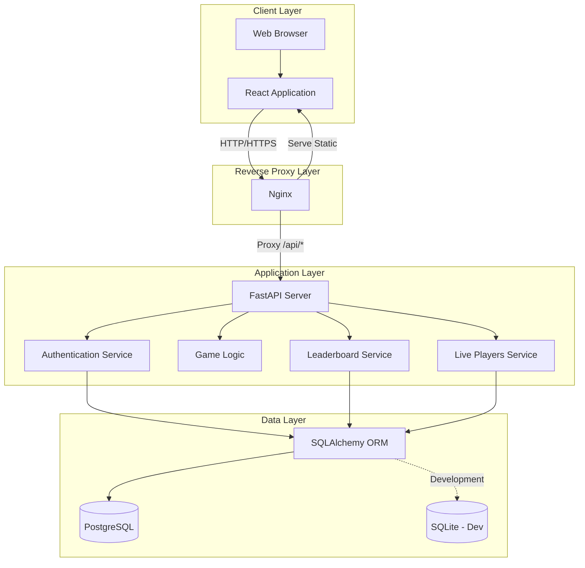
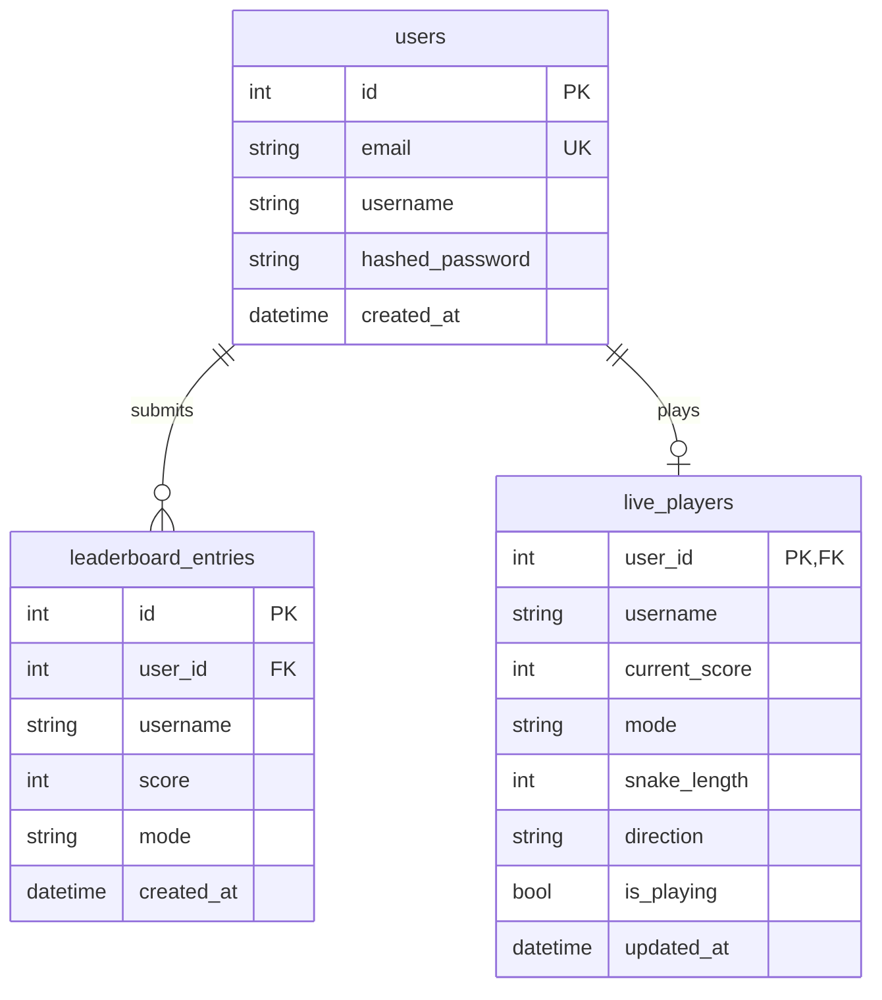
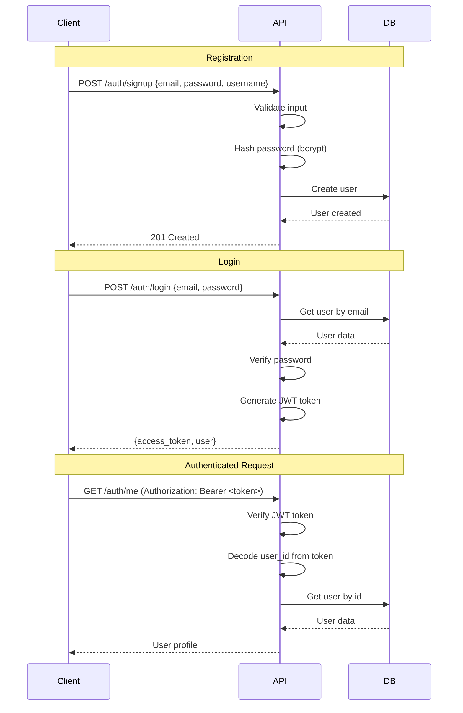
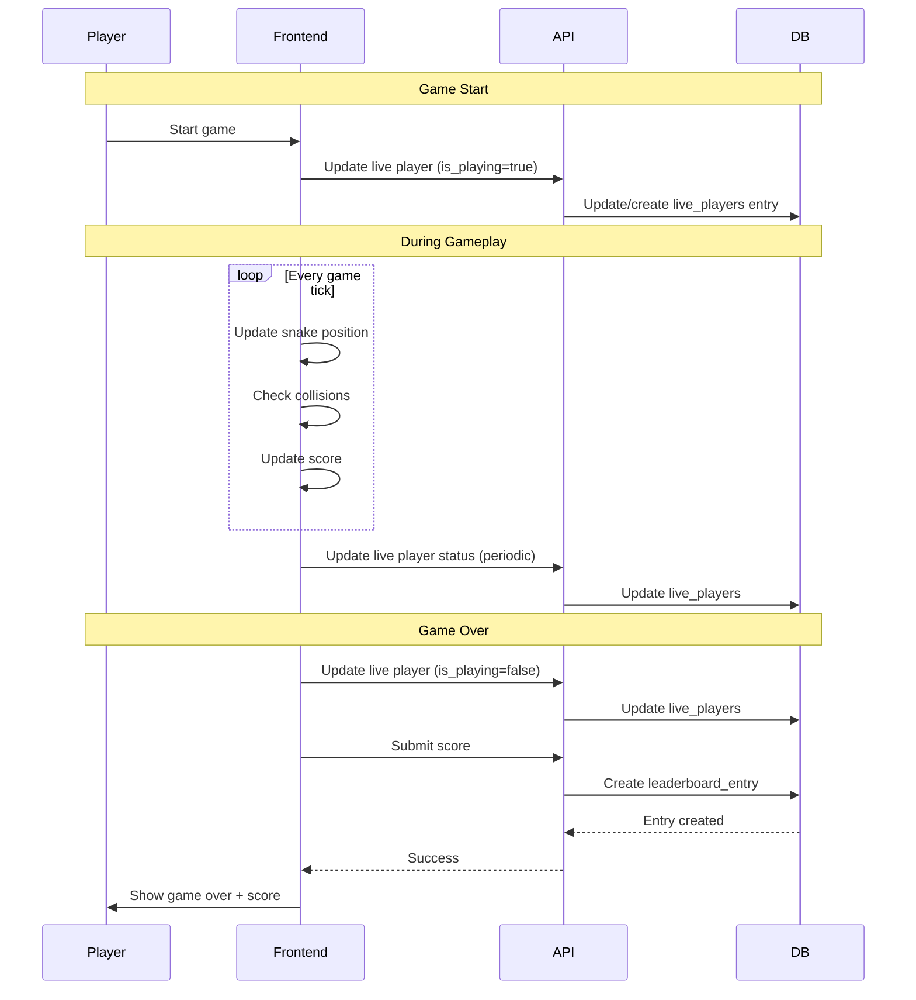
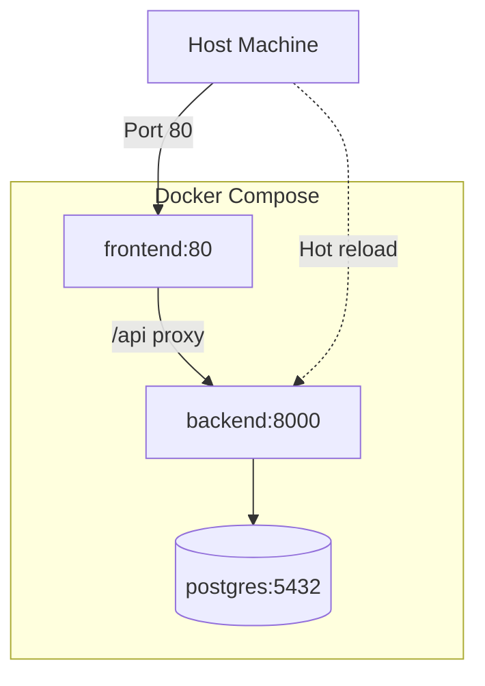
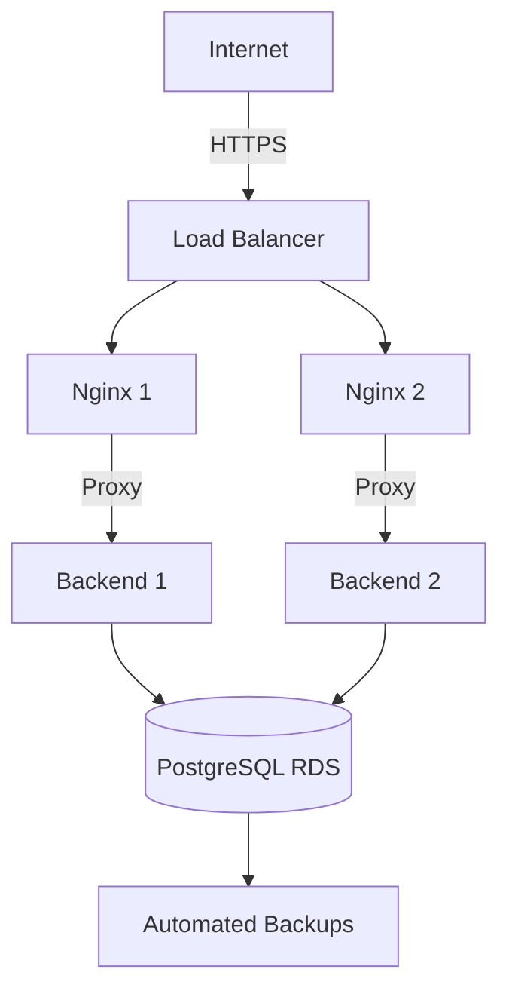

# Architecture Documentation

## System Overview

Snake Arena Live is a full-stack web application that allows users to play the classic Snake game in two modes (walls and pass-through), compete on global leaderboards, and view live player statistics. The system is built with a modern tech stack emphasizing developer experience, type safety, and scalability.

## High-Level Architecture



## Component Details

### Frontend Architecture

#### Technology Stack
- **React 18** - UI library with hooks
- **TypeScript** - Type-safe JavaScript
- **Vite** - Fast build tool and dev server
- **React Router v6** - Client-side routing
- **React Query (@tanstack/react-query)** - Server state management
- **Tailwind CSS** - Utility-first styling
- **shadcn/ui** - Pre-built accessible components

#### Directory Structure
```
frontend/
├── src/
│   ├── components/        # Reusable UI components
│   │   ├── GameCanvas.tsx     # Canvas-based game rendering
│   │   ├── GameControls.tsx   # Game control buttons
│   │   ├── Header.tsx         # App header with navigation
│   │   ├── Leaderboard.tsx    # Leaderboard display
│   │   └── SpectatorView.tsx  # Live player spectator
│   ├── contexts/          # React contexts
│   │   └── AuthContext.tsx    # Authentication state
│   ├── hooks/             # Custom React hooks
│   │   └── use-mobile.tsx     # Mobile detection hook
│   ├── pages/             # Page-level components
│   │   ├── Index.tsx          # Home/game page
│   │   ├── LoginPage.tsx      # Login form
│   │   ├── SignupPage.tsx     # Registration form
│   │   ├── LeaderboardPage.tsx# Leaderboard view
│   │   └── SpectatePage.tsx   # Spectator mode
│   ├── lib/               # Utility functions
│   └── tests/             # Test files
└── public/                # Static assets
```

#### State Management

**Client State** (React hooks):
- Component-level state with `useState`
- Global auth state via `AuthContext`
- Game state (snake position, score, etc.)

**Server State** (React Query):
- Leaderboard data
- Live player data
- User profile
- Automatic caching and revalidation

#### Routing

```typescript
Routes:
  / → Index (Game)
  /login → LoginPage
  /signup → SignupPage
  /leaderboard → LeaderboardPage
  /spectate → SpectatePage
```

### Backend Architecture

#### Technology Stack
- **FastAPI** - Modern Python web framework
- **SQLAlchemy 2.0** - ORM with async support
- **Pydantic** - Data validation and settings
- **PostgreSQL** - Production database
- **SQLite** - Development database
- **Alembic** - Database migrations
- **JWT** - Stateless authentication
- **Bcrypt** - Password hashing

#### Directory Structure
```
backend/
├── src/
│   ├── api/               # API layer
│   │   └── v1/
│   │       ├── api.py         # Router aggregation
│   │       └── endpoints/     # Endpoint modules
│   │           ├── auth.py        # Authentication endpoints
│   │           ├── leaderboard.py # Leaderboard endpoints
│   │           └── live_players.py# Live player endpoints
│   ├── core/              # Core functionality
│   │   ├── config.py          # Application settings
│   │   └── security.py        # Auth utilities
│   ├── db/                # Database layer
│   │   ├── database.py        # Database setup
│   │   ├── models.py          # SQLAlchemy models
│   │   └── session.py         # Session management & queries
│   ├── schemas/           # Pydantic schemas
│   │   ├── auth.py            # Auth request/response models
│   │   ├── game.py            # Game-related models
│   │   ├── user.py            # User models
│   │   └── enums.py           # Enumerations
│   └── main.py            # Application entry point
├── tests/                 # Unit tests
├── integration_tests/     # Integration tests
└── seed_data.py          # Database seeding script
```

#### API Design Pattern

**Layered Architecture:**

1. **Endpoint Layer** (`api/v1/endpoints/`)
   - Handle HTTP requests/responses
   - Input validation via Pydantic
   - Authentication via dependencies
   - Business logic delegation

2. **Service Layer** (implicit in endpoints)
   - Business logic
   - Data transformation
   - Error handling

3. **Data Access Layer** (`db/session.py`)
   - Database queries
   - ORM operations
   - Transaction management

**Example Flow:**
```python
# 1. Endpoint receives request
@router.post("/submit", response_model=LeaderboardEntry)
async def submit_score(
    score_data: ScoreSubmission,
    current_user: User = Depends(get_current_user),
    db: Session = Depends(get_db)
):
    # 2. Validate data (automatic via Pydantic)
    # 3. Call data access function
    entry = session.add_score(
        db, 
        current_user.id, 
        current_user.username,
        score_data.score, 
        score_data.mode
    )
    # 4. Return response
    return entry
```

### Database Schema



#### Models

**User**
- Stores user authentication and profile data
- Email must be unique
- Password is hashed with bcrypt
- One-to-many relationship with leaderboard entries

**LeaderboardEntry**
- Stores submitted game scores
- Links to user via `user_id`
- Stores `mode` (walls or pass-through)
- Indexed on `score DESC` and `mode` for fast queries

**LivePlayer**
- Stores real-time game state
- One-to-one with user (user can only have one active game)
- `is_playing` flag indicates active game
- Updated frequently during gameplay

### Authentication Flow



**JWT Token Structure:**
```json
{
  "sub": "user_id",
  "exp": 1234567890
}
```

**Token Lifetime:** 30 minutes (configurable via `ACCESS_TOKEN_EXPIRE_MINUTES`)

### Game Flow



### Deployment Architecture

#### Development (Local)

```
Developer Machine
├── Backend (localhost:8000)
│   ├── FastAPI with --reload
│   └── SQLite database
└── Frontend (localhost:8080)
    └── Vite dev server
```

#### Docker Development



**Features:**
- Hot-reload for backend (volume mount)
- Nginx serves frontend static files
- PostgreSQL with persistent volume
- Health checks for all services

#### Production



**Recommended Setup:**
- Multiple backend instances behind load balancer
- Managed PostgreSQL (AWS RDS, Google Cloud SQL)
- CDN for static frontend assets
- HTTPS with Let's Encrypt or managed certificates
- Environment-based configuration
- Structured logging to centralized service
- Monitoring (Prometheus, Grafana, DataDog, etc.)

## API Design Patterns

### RESTful Endpoints

- **Nouns for resources**: `/users`, `/leaderboard`, `/live-players`
- **HTTP methods**: GET (read), POST (create), PUT (update), DELETE (remove)
- **Versioning**: `/api/v1/` prefix
- **Consistent responses**: All errors return `{detail: "message"}`

### Error Handling

**HTTP Status Codes:**
- `200 OK` - Successful request
- `201 Created` - Resource created
- `400 Bad Request` - Invalid input
- `401 Unauthorized` - Missing/invalid auth token
- `404 Not Found` - Resource doesn't exist
- `500 Internal Server Error` - Server error

**Error Response Format:**
```json
{
  "detail": "Error message describing what went wrong"
}
```

### Authentication

- **Stateless**: JWT tokens, no server-side sessions
- **Bearer tokens**: `Authorization: Bearer <token>` header
- **Dependency injection**: `Depends(get_current_user)` for protected routes
- **Automatic validation**: FastAPI validates token and injects user

## Performance Considerations

### Backend

- **Database Indexing**: Indexes on `email`, `score DESC`, `mode`
- **Connection Pooling**: SQLAlchemy manages connection pool
- **Query Optimization**: Use SELECT only needed fields
- **Pagination**: Leaderboard limited to top N entries

### Frontend

- **Code Splitting**: Lazy loading for routes
- **Caching**: React Query caches API responses
- **Memoization**: `useMemo`, `useCallback` for expensive computations
- **Optimized Renders**: Prevent unnecessary re-renders

### Docker

- **Multi-stage builds**: Small production images
- **Layer caching**: Dependencies cached separately from code
- **Health checks**: Kubernetes/Docker Swarm integration

## Security Considerations

- **Password Hashing**: Bcrypt with salt (computationally expensive)
- **JWT Secrets**: Stored in environment variables
- **CORS**: Configured allowed origins
- **SQL Injection**: Prevented via SQLAlchemy ORM
- **XSS Prevention**: React escapes content by default
- **Input Validation**: Pydantic validates all inputs
- **HTTPS**: Required in production
- **Rate Limiting**: Can be added via nginx or middleware

## Testing Strategy

### Backend Tests (41 tests)

**Unit Tests** (`tests/`):
- Test individual functions
- Mock database
- Fast execution

**Integration Tests** (`integration_tests/`):
- Test complete workflows
- Use SQLite in-memory database
- Test authentication, leaderboard, live players
- End-to-end scenarios

### Frontend Tests

- **Component Tests**: React Testing Library
- **Unit Tests**: Utility function testing
- **Integration Tests**: Multi-component interactions

## Future Enhancements

### Scalability
- Redis for session storage and caching
- WebSocket for real-time updates
- Horizontal scaling of backend instances
- CDN for global distribution

### Features
- Real-time multiplayer mode
- Tournament system
- User achievements and badges
- Social features (friends, chat)
- Replay system
- Mobile app (React Native)

### Monitoring
- Application performance monitoring (APM)
- Error tracking (Sentry)
- User analytics
- Infrastructure monitoring

## References

- [FastAPI Documentation](https://fastapi.tiangolo.com/)
- [React Documentation](https://react.dev/)
- [SQLAlchemy Documentation](https://docs.sqlalchemy.org/)
- [PostgreSQL Documentation](https://www.postgresql.org/docs/)
